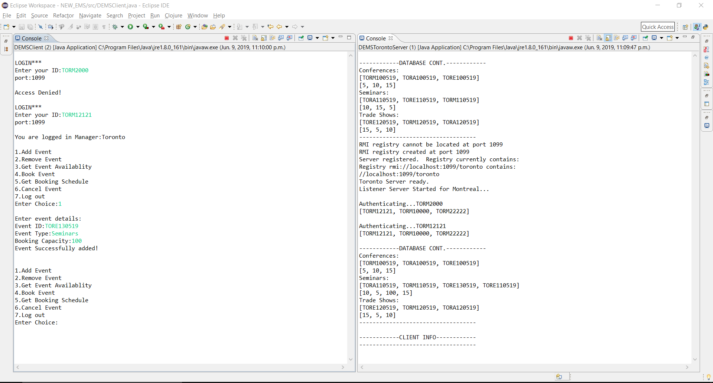
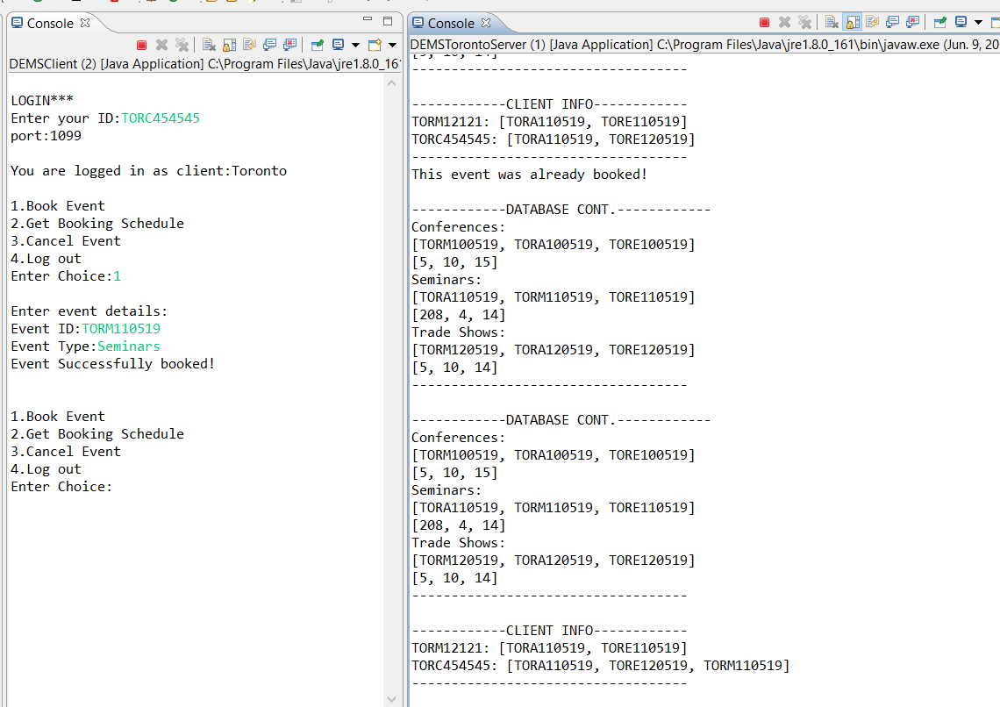

# Distributed-Event-Management-System
## Introduction
A Simulated corporate event management company
* Can manage clients located in 3 different branches with their own servers.
* Created 3 versions using web services and Java-RMI

## Screenshots

## Running instructions
* Run using Java- RMI or Webservices
* [Start Servers](/RMI/src/src/Shared/DEMSStartServers.java)
* [Run Client](/RMI/src/src/Shared/RMI/src/src/Shared/DEMSClient.java)

